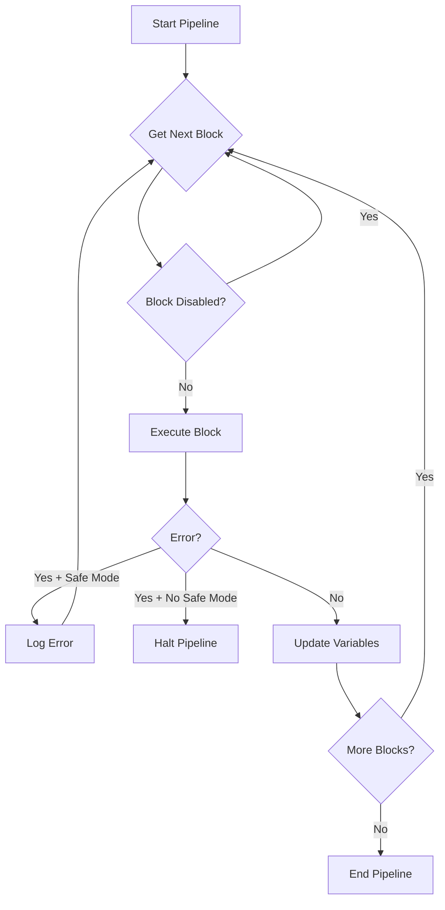

## What are Blocks?

Blocks are the fundamental building units of an IronBullet pipeline. Each block represents a single operation - making an HTTP request, parsing data, checking conditions, or manipulating variables.

<Note>
Think of blocks like Lego pieces: individual components that snap together to create complex automation workflows.
</Note>

## Block Structure

From `src/pipeline/block/mod.rs:43-66`:

```rust
pub struct Block {
    pub id: Uuid,
    pub block_type: BlockType,
    pub label: String,
    pub disabled: bool,
    pub safe_mode: bool,
    pub settings: BlockSettings,
}
```

### Core Properties

| Property | Type | Description |
|----------|------|-------------|
| `id` | UUID | Unique identifier for this block instance |
| `block_type` | BlockType | What kind of operation this block performs |
| `label` | String | Human-readable name displayed in UI |
| `disabled` | Boolean | If true, block is skipped during execution |
| `safe_mode` | Boolean | If true, errors don't halt the pipeline |
| `settings` | BlockSettings | Type-specific configuration |

## Block Categories

From `src/pipeline/block/mod.rs:213-227`, blocks are organized into categories:

<CardGroup cols={3}>
  <Card title="Requests" icon="globe" color="#0078d4">
    - HttpRequest
    - TcpRequest
    - UdpRequest
    - FtpRequest
    - SshRequest
    - ImapRequest
    - SmtpRequest
    - PopRequest
  </Card>

  <Card title="Parsing" icon="code" color="#4ec9b0">
    - ParseLR
    - ParseRegex
    - ParseJSON
    - ParseCSS
    - ParseXPath
    - ParseCookie
    - LambdaParser
  </Card>

  <Card title="Checks" icon="check-circle" color="#d7ba7d">
    - KeyCheck
  </Card>

  <Card title="Functions" icon="function" color="#c586c0">
    - StringFunction
    - ListFunction
    - CryptoFunction
    - ConversionFunction
    - DateFunction
    - FloatFunction
    - IntegerFunction
  </Card>

  <Card title="Control Flow" icon="code-branch" color="#dcdcaa">
    - IfElse
    - Loop
    - Delay
    - Script
    - CaseSwitch
    - Group
  </Card>

  <Card title="Bypass/Sensors" icon="shield" color="#2dd4bf">
    - CaptchaSolver
    - CloudflareBypass
    - DataDomeSensor
    - AkamaiV3Sensor
    - XacfSensor
  </Card>

  <Card title="Browser" icon="window" color="#e06c75">
    - BrowserOpen
    - NavigateTo
    - ClickElement
    - TypeText
    - WaitForElement
    - GetElementText
    - Screenshot
    - ExecuteJs
  </Card>

  <Card title="Utilities" icon="wrench" color="#858585">
    - Log
    - SetVariable
    - ClearCookies
    - Webhook
    - WebSocket
    - RandomUserAgent
    - RandomData
    - Plugin
  </Card>

  <Card title="File System" icon="folder" color="#d4a96a">
    - FileSystem
  </Card>
</CardGroup>

## Example Block Configuration

From `configs/example.rfx:16-39`:

```json
{
  "id": "10000000-0000-0000-0000-000000000001",
  "block_type": "HttpRequest",
  "label": "Login Request",
  "disabled": false,
  "safe_mode": false,
  "settings": {
    "type": "HttpRequest",
    "method": "POST",
    "url": "https://httpbin.org/post",
    "headers": [
      ["Content-Type", "application/json"],
      ["Accept", "application/json"]
    ],
    "body": "{\"email\":\"<input.USER>\",\"password\":\"<input.PASS>\"}",
    "body_type": "Raw",
    "content_type": "application/json",
    "follow_redirects": true,
    "timeout_ms": 10000
  }
}
```

## Safe Mode

<Warning>
When `safe_mode` is **false** (default), any error in the block will immediately halt execution and mark the data entry as ERROR.
</Warning>

<Tip>
Enable `safe_mode` on blocks that might legitimately fail (like optional cookie parsing) to allow the pipeline to continue.
</Tip>

From `src/pipeline/engine/mod.rs:200-215`:

```rust
match result {
    Ok(()) => {
        // Block succeeded - continue
    }
    Err(e) if block.safe_mode => {
        // Safe mode: log error but continue execution
        self.log.push(LogEntry {
            message: format!("[SAFE MODE] {}", e),
            ...
        });
    }
    Err(e) => {
        // Not safe mode: halt execution
        self.status = BotStatus::Error;
        return Err(e);
    }
}
```

## Execution Order

Blocks execute **sequentially** in the order they appear in the pipeline. From `src/pipeline/engine/mod.rs:155-228`:



<Note>
Each block can access variables set by previous blocks. Variable state carries forward through the entire execution.
</Note>

## Block-Specific Settings

### HttpRequest Settings

From `src/pipeline/block/settings_http.rs:23-72`:

```rust
pub struct HttpRequestSettings {
    pub method: String,              // GET, POST, PUT, DELETE, etc.
    pub url: String,                 // Supports variable interpolation
    pub headers: Vec<(String, String)>,
    pub body: String,
    pub body_type: BodyType,         // None, Raw, FormUrlEncoded, FormData
    pub content_type: String,
    pub follow_redirects: bool,
    pub max_redirects: u32,
    pub timeout_ms: u64,
    pub response_var: String,        // Where to store response (default: SOURCE)
    pub ssl_verify: bool,
    pub tls_client: TlsClient,       // AzureTLS or RustTLS
    pub browser_profile: String,     // chrome, firefox, safari, edge
    pub ja3_override: String,        // Per-block JA3 fingerprint
    pub http2fp_override: String,    // Per-block HTTP/2 fingerprint
}
```

<Tip>
Use `response_var` to store responses in different variables. For example, setting `response_var` to `"LOGIN"` will store the body in `LOGIN`, status code in `LOGIN.STATUS`, headers in `LOGIN.HEADERS`, etc.
</Tip>

### ParseJSON Settings

From `src/pipeline/block/settings_parse.rs:62-79`:

```rust
pub struct ParseJSONSettings {
    pub input_var: String,      // Variable containing JSON (default: data.SOURCE)
    pub json_path: String,      // JSONPath query (e.g., "user.email")
    pub output_var: String,     // Where to store result
    pub capture: bool,          // Mark as capture for output
}
```

### KeyCheck Settings

From `src/pipeline/block/settings_check.rs:3-47`:

```rust
pub struct KeyCheckSettings {
    pub keychains: Vec<Keychain>,
    pub stop_on_fail: bool,  // Halt pipeline on Fail status
}

pub struct Keychain {
    pub result: BotStatus,        // Success, Fail, Ban, Retry, Custom
    pub conditions: Vec<KeyCondition>,
    pub mode: KeychainMode,       // And or Or
}

pub struct KeyCondition {
    pub source: String,           // Variable to check (e.g., data.RESPONSECODE)
    pub comparison: Comparison,   // EqualTo, Contains, MatchesRegex, etc.
    pub value: String,            // Value to compare against
}
```

Example from `configs/example.rfx:56-83`:

```json
{
  "block_type": "KeyCheck",
  "label": "Check Status",
  "settings": {
    "type": "KeyCheck",
    "keychains": [
      {
        "result": "Success",
        "conditions": [
          {
            "source": "data.RESPONSECODE",
            "comparison": "EqualTo",
            "value": "200"
          }
        ]
      },
      {
        "result": "Fail",
        "conditions": [
          {
            "source": "data.RESPONSECODE",
            "comparison": "EqualTo",
            "value": "401"
          }
        ]
      }
    ]
  }
}
```

## Bot Status Values

From `src/pipeline/mod.rs:315-324`:

```rust
pub enum BotStatus {
    None,      // Not yet determined
    Success,   // Valid hit (account works, target succeeded)
    Fail,      // Invalid (wrong password, not found)
    Ban,       // IP/proxy banned, rate limited
    Retry,     // Temporary error, try again
    Error,     // Fatal error in execution
    Custom,    // User-defined custom status
}
```

<CardGroup cols={3}>
  <Card title="Success" icon="circle-check" color="green">
    Valid hit - saved to output
  </Card>
  <Card title="Fail" icon="circle-xmark" color="red">
    Invalid credential/data
  </Card>
  <Card title="Ban" icon="ban" color="orange">
    Proxy/IP banned - triggers proxy rotation
  </Card>
  <Card title="Retry" icon="rotate" color="blue">
    Temporary error - data re-queued
  </Card>
  <Card title="Error" icon="triangle-exclamation" color="red">
    Fatal execution error
  </Card>
  <Card title="Custom" icon="gear" color="purple">
    User-defined status
  </Card>
</CardGroup>

## Block Results

During execution, each block generates a `BlockResult` stored in the execution context (from `src/pipeline/engine/mod.rs:98-127`):

```rust
pub struct BlockResult {
    pub block_id: Uuid,
    pub block_label: String,
    pub block_type: BlockType,
    pub success: bool,
    pub timing_ms: u64,
    pub variables_after: HashMap<String, String>,
    pub log_message: String,
    pub request: Option<RequestInfo>,
    pub response: Option<ResponseInfo>,
}
```

This allows you to debug exactly what happened at each step.

## Common Patterns

<AccordionGroup>
  <Accordion title="Multi-Step Login">
    ```json
    [
      { "block_type": "HttpRequest", "label": "Get Login Page" },
      { "block_type": "ParseLR", "label": "Extract CSRF Token" },
      { "block_type": "HttpRequest", "label": "Submit Login" },
      { "block_type": "KeyCheck", "label": "Check Login Status" }
    ]
    ```
  </Accordion>

  <Accordion title="API with Token">
    ```json
    [
      { "block_type": "HttpRequest", "label": "Get Token" },
      { "block_type": "ParseJSON", "label": "Extract Token" },
      { "block_type": "HttpRequest", "label": "API Call with Token" },
      { "block_type": "ParseJSON", "label": "Extract Data" },
      { "block_type": "KeyCheck", "label": "Validate Response" }
    ]
    ```
  </Accordion>

  <Accordion title="Retry on Rate Limit">
    ```json
    [
      { "block_type": "HttpRequest", "label": "Make Request" },
      {
        "block_type": "KeyCheck",
        "keychains": [
          { "result": "Retry", "conditions": [{ "source": "data.RESPONSECODE", "comparison": "EqualTo", "value": "429" }] },
          { "result": "Success", "conditions": [{ "source": "data.RESPONSECODE", "comparison": "EqualTo", "value": "200" }] }
        ]
      }
    ]
    ```
  </Accordion>
</AccordionGroup>

## Related Concepts

<CardGroup cols={3}>
  <Card title="Pipelines" icon="diagram-project" href="/concepts/pipelines">
    How blocks fit into pipelines
  </Card>
  
  <Card title="Variables" icon="brackets-curly" href="/concepts/variables">
    Using variables in block settings
  </Card>
  
  <Card title="Proxy Rotation" icon="shuffle" href="/concepts/proxy-rotation">
    Ban detection and proxy switching
  </Card>
</CardGroup>
