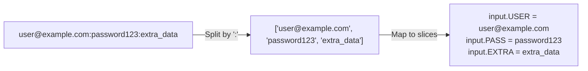

## Data Settings Overview

Data settings control how IronBullet reads and parses input data. Each line in your wordlist is split according to these rules and mapped to `input.*` variables.

<Note>
Data settings transform raw text lines like `user@example.com:password123` into structured variables like `input.USER` and `input.PASS`.
</Note>

## Data Settings Structure

From `src/pipeline/mod.rs:66-81`:

```rust
pub struct DataSettings {
    pub wordlist_type: String,  // Preset format (Credentials, Url, Custom)
    pub separator: char,         // Character to split on (':' for credentials)
    pub slices: Vec<String>,     // Names for each split part
}

impl Default for DataSettings {
    fn default() -> Self {
        Self {
            wordlist_type: "Credentials".into(),
            separator: ':',
            slices: vec!["USER".into(), "PASS".into()],
        }
    }
}
```

### Configuration Fields

| Field | Type | Description |
|-------|------|-------------|
| `wordlist_type` | String | Preset format name (Credentials, Url, Custom, etc.) |
| `separator` | Char | Character to split each line on |
| `slices` | Array of strings | Ordered names for the split parts |

## Wordlist Types

Common preset formats:

<CardGroup cols={2}>
  <Card title="Credentials" icon="key">
    **Format:** `username:password`
    
    ```json
    {
      "wordlist_type": "Credentials",
      "separator": ":",
      "slices": ["USER", "PASS"]
    }
    ```
    
    **Example data:**
    ```
    john@example.com:password123
    alice:secretpass
    bob@test.com:myp@ssw0rd
    ```
    
    **Variables:**
    - `input.USER` → `john@example.com`
    - `input.PASS` → `password123`
  </Card>

  <Card title="Email:Password:Extra" icon="envelope">
    **Format:** `email:password:extra`
    
    ```json
    {
      "wordlist_type": "Custom",
      "separator": ":",
      "slices": ["EMAIL", "PASS", "EXTRA"]
    }
    ```
    
    **Example data:**
    ```
    user@gmail.com:pass123:backup@email.com
    alice@yahoo.com:secret:+1234567890
    ```
    
    **Variables:**
    - `input.EMAIL`
    - `input.PASS`
    - `input.EXTRA`
  </Card>

  <Card title="URL" icon="link">
    **Format:** Single column (no separator)
    
    ```json
    {
      "wordlist_type": "Url",
      "separator": ":",
      "slices": ["URL"]
    }
    ```
    
    **Example data:**
    ```
    https://example.com/page1
    https://example.com/page2
    https://test.com/api/endpoint
    ```
    
    **Variables:**
    - `input.URL` → full line
  </Card>

  <Card title="Custom" icon="wrench">
    **Format:** Pipe-separated values
    
    ```json
    {
      "wordlist_type": "Custom",
      "separator": "|",
      "slices": ["ID", "NAME", "EMAIL", "PHONE"]
    }
    ```
    
    **Example data:**
    ```
    1001|John Smith|john@example.com|555-0123
    1002|Alice Jones|alice@test.com|555-0124
    ```
  </Card>
</CardGroup>

## Example Configuration

From `configs/example.rfx:87-91`:

```json
{
  "data_settings": {
    "wordlist_type": "Credentials",
    "separator": ":",
    "slices": ["USER", "PASS"]
  }
}
```

This parses each line of your wordlist:

```
user1@example.com:password123
```

Into variables:
- `input.USER` = `user1@example.com`
- `input.PASS` = `password123`

## Data Source Types

From `src/runner/job.rs:46-60`:

```rust
pub struct DataSource {
    pub source_type: DataSourceType,
    pub value: String,
}

pub enum DataSourceType {
    File,          // Load from file path
    Folder,        // Load all files in folder
    Url,           // Download from URL
    Inline,        // Direct text input
    Range,         // Generate numeric range
    Combinations,  // Generate combinations
}
```

<AccordionGroup>
  <Accordion title="File Source">
    Load data from a text file:
    
    ```json
    {
      "source_type": "File",
      "value": "/path/to/wordlist.txt"
    }
    ```
    
    File contents:
    ```txt
    user1@example.com:pass123
    user2@example.com:pass456
    user3@example.com:pass789
    ```
  </Accordion>

  <Accordion title="Folder Source">
    Load all `.txt` files from a directory:
    
    ```json
    {
      "source_type": "Folder",
      "value": "/path/to/wordlists/"
    }
    ```
    
    Combines all files:
    ```
    /path/to/wordlists/list1.txt
    /path/to/wordlists/list2.txt
    /path/to/wordlists/list3.txt
    ```
  </Accordion>

  <Accordion title="URL Source">
    Download wordlist from HTTP/HTTPS:
    
    ```json
    {
      "source_type": "Url",
      "value": "https://example.com/wordlist.txt"
    }
    ```
    
    Downloads and parses the remote file.
  </Accordion>

  <Accordion title="Inline Source">
    Paste data directly into the config:
    
    ```json
    {
      "source_type": "Inline",
      "value": "user1:pass1\nuser2:pass2\nuser3:pass3"
    }
    ```
    
    Useful for testing or small datasets.
  </Accordion>

  <Accordion title="Range Source">
    Generate numeric sequences:
    
    ```json
    {
      "source_type": "Range",
      "value": "1-1000"
    }
    ```
    
    Generates:
    ```
    1
    2
    3
    ...
    1000
    ```
    
    Access via `input.NUMBER` or your configured slice name.
  </Accordion>

  <Accordion title="Combinations Source">
    Generate combinations from multiple lists:
    
    ```json
    {
      "source_type": "Combinations",
      "value": "users.txt:passwords.txt"
    }
    ```
    
    If `users.txt` has 100 users and `passwords.txt` has 50 passwords, generates 5,000 combinations.
  </Accordion>
</AccordionGroup>

## Separator Characters

Common separators:

| Character | Use Case | Example |
|-----------|----------|----------|
| `:` (colon) | Credentials, standard format | `user:pass` |
| `|` (pipe) | CSV-like data | `id|name|email` |
| `,` (comma) | CSV files | `john,smith,john@example.com` |
| `\t` (tab) | TSV files | `user\tpass\temail` |
| `;` (semicolon) | European CSV | `name;email;phone` |
| ` ` (space) | Space-delimited | `user pass extra` |

<Warning>
If your data contains the separator character (e.g., password contains `:`), consider using a different separator or escaping.
</Warning>

## Slice Mapping

Slices are mapped **in order** to the split parts:



### Example Configurations

<Tabs>
  <Tab title="2 Slices">
    ```json
    {
      "separator": ":",
      "slices": ["USER", "PASS"]
    }
    ```
    
    **Input:** `alice@test.com:secretpass`
    
    **Variables:**
    - `input.USER` = `alice@test.com`
    - `input.PASS` = `secretpass`
  </Tab>

  <Tab title="3 Slices">
    ```json
    {
      "separator": ":",
      "slices": ["EMAIL", "PASS", "BACKUP"]
    }
    ```
    
    **Input:** `user@gmail.com:pass123:backup@email.com`
    
    **Variables:**
    - `input.EMAIL` = `user@gmail.com`
    - `input.PASS` = `pass123`
    - `input.BACKUP` = `backup@email.com`
  </Tab>

  <Tab title="4 Slices">
    ```json
    {
      "separator": "|",
      "slices": ["ID", "NAME", "EMAIL", "PHONE"]
    }
    ```
    
    **Input:** `1001|John Smith|john@example.com|555-0123`
    
    **Variables:**
    - `input.ID` = `1001`
    - `input.NAME` = `John Smith`
    - `input.EMAIL` = `john@example.com`
    - `input.PHONE` = `555-0123`
  </Tab>

  <Tab title="Single Slice">
    ```json
    {
      "separator": ":",
      "slices": ["URL"]
    }
    ```
    
    **Input:** `https://example.com/api/endpoint`
    
    **Variables:**
    - `input.URL` = `https://example.com/api/endpoint`
  </Tab>
</Tabs>

## Data Pool Processing

From `src/runner/data_pool.rs:4-57`, the data pool manages how lines are consumed:

```rust
pub struct DataPool {
    lines: Vec<String>,
    index: AtomicUsize,
    retry_queue: Mutex<Vec<(String, u32)>>,
}

impl DataPool {
    pub fn next_line(&self) -> Option<(String, u32)> {
        // First check retry queue
        if let Ok(mut queue) = self.retry_queue.lock() {
            if let Some(entry) = queue.pop() {
                return Some(entry);
            }
        }
        // Then get next line from main pool
        let idx = self.index.fetch_add(1, Ordering::Relaxed);
        self.lines.get(idx).map(|l| (l.clone(), 0))
    }

    pub fn return_line(&self, line: String, retry_count: u32) {
        if let Ok(mut queue) = self.retry_queue.lock() {
            queue.push((line, retry_count));
        }
    }
}
```

<Info>
When a block returns `BotStatus::Retry`, the data line is added back to the retry queue and will be processed again.
</Info>

## Runner Settings for Data

From `src/pipeline/mod.rs:173-233`, you can control how data is processed:

```rust
pub struct RunnerSettings {
    pub threads: u32,                  // Concurrent workers
    pub skip: u32,                     // Skip first N lines
    pub take: u32,                     // Process only N lines (0 = all)
    pub max_retries: u32,              // Max retries per line
    pub continue_statuses: Vec<BotStatus>, // Statuses that re-queue
}
```

### Example: Process subset of data

```json
{
  "runner_settings": {
    "threads": 100,
    "skip": 1000,        // Skip first 1000 lines
    "take": 5000,        // Process next 5000 lines
    "max_retries": 3
  }
}
```

This would process lines 1001-6000 from your wordlist.

## Using Input Variables

Once parsed, access input data in any block using `<input.SLICE_NAME>`:

<Tabs>
  <Tab title="HTTP Body">
    ```json
    {
      "block_type": "HttpRequest",
      "settings": {
        "method": "POST",
        "body": "username=<input.USER>&password=<input.PASS>"
      }
    }
    ```
  </Tab>

  <Tab title="URL Parameters">
    ```json
    {
      "block_type": "HttpRequest",
      "settings": {
        "url": "https://api.example.com/user/<input.USER>/profile"
      }
    }
    ```
  </Tab>

  <Tab title="Headers">
    ```json
    {
      "block_type": "HttpRequest",
      "settings": {
        "headers": [
          ["X-User-ID", "<input.ID>"],
          ["X-User-Email", "<input.EMAIL>"]
        ]
      }
    }
    ```
  </Tab>

  <Tab title="JSON Body">
    ```json
    {
      "block_type": "HttpRequest",
      "settings": {
        "body": "{\"email\":\"<input.EMAIL>\",\"password\":\"<input.PASS>\",\"phone\":\"<input.PHONE>\"}"
      }
    }
    ```
  </Tab>
</Tabs>

## Best Practices

<CardGroup cols={2}>
  <Card title="Clean Data" icon="broom">
    - Remove duplicate lines
    - Trim whitespace
    - Validate format consistency
    - Remove empty lines
  </Card>

  <Card title="Naming" icon="tag">
    - Use descriptive slice names
    - Prefer UPPERCASE
    - Match your domain (USER vs EMAIL vs USERNAME)
  </Card>

  <Card title="Performance" icon="gauge">
    - Use skip/take for testing subsets
    - Start with small wordlists
    - Gradually increase thread count
  </Card>

  <Card title="Format" icon="file-lines">
    - Keep separators consistent
    - Document your format
    - Use standard types when possible
  </Card>
</CardGroup>

## Troubleshooting

<AccordionGroup>
  <Accordion title="Variables are empty">
    **Problem:** `input.USER` is empty even though wordlist has data.
    
    **Solutions:**
    - Check separator matches your data format
    - Verify slice names match variable references
    - Ensure no extra spaces around separator
    - Check for UTF-8/encoding issues
  </Accordion>

  <Accordion title="Too many/few slices">
    **Problem:** Lines have different number of separator characters.
    
    **Solutions:**
    - Clean your wordlist to consistent format
    - Choose a separator not present in data
    - Use only as many slices as minimum split count
  </Accordion>

  <Accordion title="Special characters in data">
    **Problem:** Data contains separator character (e.g., `:` in password).
    
    **Solutions:**
    - Use different separator (e.g., `|` or `\t`)
    - URL-encode the data
    - Escape the character
    - Use a different wordlist format
  </Accordion>
</AccordionGroup>

## Related Concepts

<CardGroup cols={3}>
  <Card title="Variables" icon="brackets-curly" href="/concepts/variables">
    How input.* variables work
  </Card>
  
  <Card title="Blocks" icon="cube" href="/concepts/blocks">
    Using input variables in blocks
  </Card>
  
  <Card title="Pipelines" icon="diagram-project" href="/concepts/pipelines">
    Complete pipeline configuration
  </Card>
</CardGroup>
