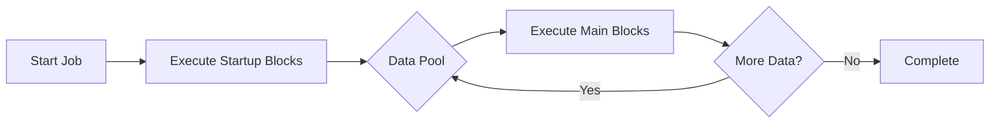

## What is a Pipeline?

A pipeline in IronBullet is the complete configuration that defines how to process data entries (like credentials, URLs, or custom data formats). Each pipeline contains:

- **Metadata** - Name, author, timestamps
- **Blocks** - Sequential operations to execute
- **Data settings** - How to parse input data
- **Proxy settings** - Proxy rotation and health checking
- **Browser settings** - TLS fingerprinting and user agent emulation
- **Runner settings** - Concurrency, retry logic, thread management
- **Output settings** - Where and how to save results

<Note>
Pipelines are saved as `.rfx` files (ReqFlow eXchange format) - JSON files that contain all configuration needed to run a job.
</Note>

## Pipeline Structure

From `src/pipeline/mod.rs:28-45` and `src/export/format.rs:4-18`:

```rust
pub struct Pipeline {
    pub id: Uuid,
    pub name: String,
    pub author: String,
    pub created: DateTime<Utc>,
    pub modified: DateTime<Utc>,
    pub blocks: Vec<Block>,
    pub startup_blocks: Vec<Block>,
    pub data_settings: DataSettings,
    pub proxy_settings: ProxySettings,
    pub browser_settings: BrowserSettings,
    pub runner_settings: RunnerSettings,
    pub output_settings: OutputSettings,
}

pub struct RfxConfig {
    pub version: u32,
    pub metadata: RfxMetadata,
    pub pipeline: Pipeline,
}
```

## Example Pipeline Configuration

Here's a complete example from `configs/example.rfx`:

```json
{
  "version": 1,
  "metadata": {
    "name": "Example Login Config",
    "author": "reqflow",
    "created": "2026-02-15T00:00:00Z",
    "modified": "2026-02-15T00:00:00Z"
  },
  "pipeline": {
    "id": "00000000-0000-0000-0000-000000000001",
    "name": "Example Login Config",
    "author": "reqflow",
    "blocks": [
      // ... blocks array
    ],
    "data_settings": {
      "wordlist_type": "Credentials",
      "separator": ":",
      "slices": ["USER", "PASS"]
    },
    "proxy_settings": {
      "proxy_mode": "None"
    },
    "browser_settings": {
      "browser": "chrome"
    }
  }
}
```

## Metadata Fields

| Field | Type | Description |
|-------|------|-------------|
| `id` | UUID | Unique identifier for the pipeline |
| `name` | String | Display name for the config |
| `author` | String | Creator of the configuration |
| `created` | DateTime | When the config was first created |
| `modified` | DateTime | Last modification timestamp |

## Main vs Startup Blocks

<CardGroup cols={2}>
  <Card title="Main Blocks" icon="play">
    Execute for **every data line** in your wordlist. This is where your core logic goes (HTTP requests, parsing, checks).
  </Card>
  
  <Card title="Startup Blocks" icon="rocket">
    Execute **once at the beginning** before processing any data. Useful for obtaining tokens, setting up sessions, or initializing global variables.
  </Card>
</CardGroup>



## Pipeline Execution Flow

From `src/pipeline/engine/mod.rs:148-228`:

1. **Initialize context** - Create execution context with variable store
2. **Run startup blocks** - Execute once before main loop
3. **Load data entry** - Get next line from data pool
4. **Parse data** - Split by separator into named slices
5. **Execute blocks** - Run each block sequentially
6. **Check status** - Evaluate KeyCheck conditions
7. **Save results** - Write hits/fails to output
8. **Repeat** - Continue until data pool is empty

<Note>
Blocks execute **sequentially** in the order they appear. If a block sets the bot status (Success, Fail, Ban, etc.), subsequent KeyCheck blocks may terminate execution early.
</Note>

## Configuration Best Practices

<AccordionGroup>
  <Accordion title="Naming Conventions">
    - Use descriptive config names like "Instagram Login" not "config1"
    - Label blocks clearly ("Get CSRF Token" not "HTTP Request")
    - Name variables meaningfully ("AUTH_TOKEN" not "var1")
  </Accordion>

  <Accordion title="Organization">
    - Group related blocks together
    - Use startup blocks for one-time initialization
    - Keep parsing logic close to the request that generates the data
  </Accordion>

  <Accordion title="Error Handling">
    - Enable safe mode on blocks that might fail
    - Set appropriate retry counts in runner settings
    - Use KeyCheck blocks to detect bans vs legitimate fails
  </Accordion>
</AccordionGroup>

## Default Values

From `src/pipeline/mod.rs:47-64`:

```rust
impl Default for Pipeline {
    fn default() -> Self {
        Self {
            id: Uuid::new_v4(),
            name: "New Config".into(),
            author: String::new(),
            blocks: Vec::new(),
            startup_blocks: Vec::new(),
            data_settings: DataSettings::default(),  // Credentials mode
            proxy_settings: ProxySettings::default(), // No proxies
            browser_settings: BrowserSettings::default(), // Chrome
            runner_settings: RunnerSettings::default(), // 100 threads
            output_settings: OutputSettings::default(), // results/
        }
    }
}
```

## Related Concepts

<CardGroup cols={3}>
  <Card title="Blocks" icon="cube" href="/concepts/blocks">
    Learn about the building blocks of pipelines
  </Card>
  
  <Card title="Variables" icon="brackets-curly" href="/concepts/variables">
    Understand the variable system
  </Card>
  
  <Card title="Data Input" icon="database" href="/concepts/data-input">
    Configure data parsing and wordlists
  </Card>
</CardGroup>
